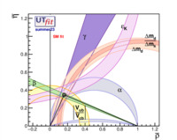
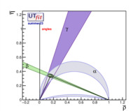
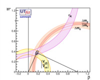
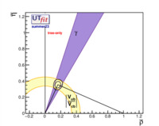
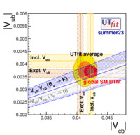

# Standard model fit

## CKM matrix

$$V_{CKM}= \begin{pmatrix}
(0.97431 \pm 0.00017) & (0.2251 \pm 0.0007) & (0.00370 \pm 0.00008)e^{i(-65.3 \pm 1.3)^\circ}\\\\
( -0.2250 \pm 0.0007)e^{i(-179.9651 \pm 0.0008)^\circ} & (0.97345 \pm 0.00017)e^{i(-0.001866 \pm 0.000045)^\circ} & (0.04194 \pm 0.00041) \\\\
( 0.00858 \pm 0.00010)e^{i(-22.37 \pm 0.57)^\circ} & (-0.04121 \pm 0.00040)e^{i(-178.951 \pm 0.027)^\circ} & (0.999113 \pm 0.000017)
\end{pmatrix} $$

## Table of inputs, posterior values and predictions from the global fit

Predictions are obtained by removing the given constraint from the global fit. The table looks like:

|  *Parameter*  |   *Input value*  |  *Full fit*  |  *SM Prediction*  | *Pull* |
|  :--:  |   :--:  |  :--:  |  :--:  | :--: |
|   $$\bar{\rho}$$  |  $$-$$  |  $$0.160 \pm 0.009$$  |  $$-$$  | $$-$$ |
|   $$\bar{\eta}$$  |  $$-$$  |  $$0.346 \pm 0.009$$  |  $$-$$  | $$-$$ |
|   $$\rho$$   |  $$-$$  |  $$0.164 \pm 0.009$$  |  $$-$$  | $$-$$ |
|   $$\eta$$   |  $$-$$  |  $$0.355 \pm 0.009$$  |  $$-$$  | $$-$$ |
|   $$A$$   |  $$-$$  |  $$0.828 \pm 0.010$$  |  $$-$$  | $$-$$ |
|   $$\lambda$$   |  $$-$$  |  $$0.2251 \pm 0.0008$$  |  $$-$$  | $$-$$ |
|   $$J_{cp}\cdot10^{5}$$   |  $$-$$  |  $$3.09 \pm 0.07$$  |  $$-$$  | $$-$$ |
|   $$\sin\theta_{12}$$   |  $$-$$  |  $$0.2251 \pm 0.0008$$  |  $$-$$  | $$-$$ |
|   $$\sin\theta_{23}$$   |  $$-$$  |  $$0.04193 \pm 0.00041$$  |  $$-$$  | $$-$$ |
|   $$\sin\theta_{13}$$   |  $$-$$  |  $$0.00370 \pm 0.00008$$  |  $$-$$  | $$-$$ |
|   $$\delta [^{\circ}]$$   |  $$-$$  |  $$1.139 \pm 0.023$$  |  $$-$$  | $$-$$ |
|  $$\|V_{ud}\|$$   |  $$0.97433 \pm 0.00017$$  |  $$0.97431 \pm 0.00017$$  |  $$0.9737 \pm 0.0011$$  | $$0.6$$ | 
|  $$\|V_{ub}\|$$   |  $$0.00375 \pm 0.00026 $$  |  $$0.003702 \pm 0.000081$$  |  $$0.003696 \pm 0.000087$$  | $$0.2$$ | 
|  $$\|V_{cb}\|$$   |  $$0.04132 \pm 0.00073 $$  |  $$0.04194 \pm 0.00041$$  |  $$0.04221 \pm 0.00051$$  | $$1.0$$ | 
|  $$\gamma [^{\circ}]$$   |  $$65.4 \pm 3.3$$  |  $$65.1 \pm 1.3$$  |  $$65.2 \pm 1.5$$  | $$0.1$$ | 
|  $$\alpha [^{\circ}]$$   |  $$93.8 \pm 4.5$$  |  $$92.4 \pm 1.4$$  |  $$92.3 \pm 1.5$$  | $$0.3$$ |
|  $$\beta [^{\circ}]$$   |  $$-$$  |  $$22.4 \pm 0.6$$  |  $$23.9 \pm 1.2$$  | $$-$$ |
|  $$\sin(2\beta)$$   |  $$0.689 \pm 0.019$$  |  $$0.705 \pm 0.014$$  |  $$0.739 \pm 0.027$$  | $$1.5$$ |
|  $$\cos(2\beta)$$   |  $$-$$  |  $$-$$  |  $$0.709 \pm 0.014$$  | $$-$$ |
|  $$2\beta+\gamma [^{\circ}]$$   |  $$-$$  |  $$-$$  |  $$110.1 \pm 1.7$$  | $$-$$ |
|  $$\phi_s$$   |  $$-$$  |  $$-$$  |  $$-0.0367 \pm 0.0010$$  | $$-$$ |
|  $$m_{c}\mathrm{ [GeV/c^{2}]}$$   |  $$1.2917 \pm 0.0048$$  |  $$-$$  |  $$-$$  | $$-$$ |
|  $$m_{b}\mathrm{ [GeV/c^{2}]}$$   |  $$4.196 \pm 0.014$$  |  $$-$$  |  $$-$$  | $$-$$ |
|  $$m_{t}\mathrm{ [GeV/c^{2}]}$$  |  $$171.79 \pm 0.38$$  |  $$-$$  |  $$-$$  | $$-$$ |
|  $$\|\epsilon\|$$   |  $$0.002228 \pm 0.000011$$  |  $$0.002227 \pm 0.000014$$  |  $$0.00200 \pm 0.00014$$  | $$1.6$$ |
|  $$\epsilon^{\prime}/\epsilon$$   |  $$0.00166 \pm 0.00033$$  |  $$0.00161 \pm 0.00028$$  |  $$0.00146 \pm 0 .00045$$  | $$0.3$$ |
|  $$\Delta m_{s} \mathrm{[ps^{-1}]}$$   |  $$17.741 \pm 0.020$$  |  $$17.741 \pm 0.020$$  |  $$17.89 \pm 0.65$$  | $$0.2$$ |
|  $$\Delta m_{d} \mathrm{[ps^{-1}]}$$   |  $$0.5065 \pm 0.0019$$  |  $$0.5067 \pm 0.0020$$  |  $$0.519 \pm 0.022$$  | $$0.6$$ |
|  $$B(B\rightarrow\tau\nu) \cdot 10^{4}$$   |  $$1.06 \pm 0.19$$  |  $$0.872 \pm 0.041$$  |  $$0.865 \pm 0.041$$  | $$1.0$$ |
|  $$\bar {B}(B_{s}\rightarrow ll)\cdot 10^{9}$$ |  $$3.41 \pm 0.29$$  |  $$3.44 \pm 0.12$$  |  $$3.45 \pm 0.13$$  | $$0.1$$ |

## Fit Results on the \\( \bar{\rho}-\bar{\eta} \\) complex plane

| Full fit result for $$\bar{\rho} - \bar{\eta}$$ | Angles-only result for $$\bar{\rho} - \bar{\eta}$$ | Sides-only result for $$\bar{\rho} - \bar{\eta}$$ | Tree-only result for $$\bar{\rho} - \bar{\eta}$$ |
| -- | -- | -- | -- |
|  |  |  |  |
| [EPS](images/rhoeta-fullfit-sm.eps) - [PDF](images/rhoeta-fullfit-sm.pdf) - [PNG](images/rhoeta-fullfit-sm.png) - [JPG](images/rhoeta-fullfit-sm.jpg) - [GIF](images/rhoeta-fullfit-sm.gif) | [EPS](images/rhoeta-angles-sm.eps) - [PDF](images/rhoeta-angles-sm.pdf) - [PNG](images/rhoeta-angles-sm.png) - [JPG](images/rhoeta-angles-sm.jpg) - [GIF](images/rhoeta-angles-sm.gif) |  [EPS](images/rhoeta-sides-sm.eps) - [PDF](images/rhoeta-sides-sm.pdf) - [PNG](images/rhoeta-sides-sm.png) - [JPG](images/rhoeta-sides-sm.jpg) - [GIF](images/rhoeta-sides-sm.gif)  |  [EPS](images/rhoeta-tree-sm.eps) - [PDF](images/rhoeta-tree-sm.pdf) - [PNG](images/rhoeta-tree-sm.png) - [JPG](images/rhoeta-tree-sm.jpg) - [GIF](images/rhoeta-tree-sm.gif) |

## Selection of Probability Density plots for input values, posterior values, predictions and pulls

| Fit Input for $$\|V_{cb}\|-\|V_{ub}\|$$ | xxx | yyy | zzz |
| -- | -- | -- | -- |
|  | aaa | bbb | ccc |
| [EPS](./images/VubVcbPlot.eps) - [PDF](./images/VubVcbPlot.pdf) - [PNG](./images/VubVcbPlot.png) - [JPG](./images/VubVcbPlot.jpg) - [GIF](./images/VubVcbPlot.gif)
